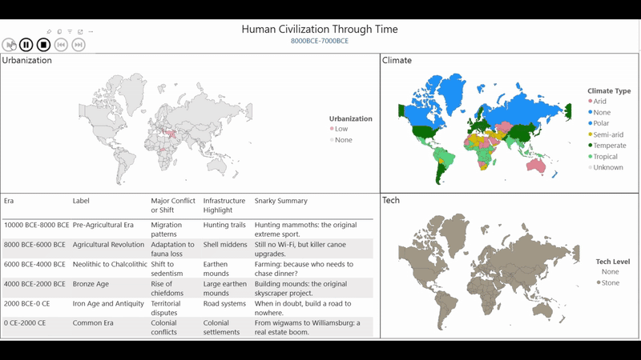

## Can an LLM Consistently Generate Structured Tabular Data

*An experiment in guided synthetic history, Azure Functions, and Power BI*

### Intro: Structured Synthetic Data in Practice

Synthetic data gets attention for filling in gaps where real-world datasets fail but does it scale. The real question is: **Can a language model modify standardized tabular data cleanly enough to plug into an existing data model without breaking the architecture?**

That’s what I set out to test. My goal wasn’t storytelling—it was structure. Could an LLM fill in missing data across countries and millennia in a way that’s **schema-compliant**, **reasoned**, and **usable in Power BI**?

### What I Built

I built an automated pipeline combining Azure Functions, Power BI, and an LLM to simulate historical records by country and 1,000-year block. Key components:

- **ETL**  
  To start I pulled a list of ISO countries and empires from Wikipedia so we could create a query per country. Using basic concatenation I then generated a query per line outlining input data, rules and exact expected tabular output.  
  [GitHub: Synthetic-Era-Generation](https://github.com/TaylorRogers/Synthetic-Era-Generation)

- **Prompt Structure**  
  This prompt defines a structured template for generating historical data row-by-row from a millennium-based table. It sets the assistant's role, anchors to a country and time period, enforces strict schema and 1:1 output rules, and provides formatting, value constraints, and an example CSV for consistent post-processing.
  [See Below]

- **LLM Buffer Azure Functions & Blob**  
  When working with the Power BI interface it makes a lot of repeat calls and so I needed to buffer the OpenAI API with a datalake buffer. Prompts were sent via a Power BI-triggered Azure Function, which returned a CSV block with one row per millennial slice—strictly ordered and never merged.  
  [GitHub: LLM Buffer](https://github.com/TaylorRogers/llm-buffer)

- **Model**  
  The output table was expanded, filtered, and assigned composite keys (`GeoHistory_Key`) for cross-time analysis. I built a basic model linking our synthetic data and country codes, empires, and eras. The required double-sided relationships were done with distinct DAX bridge tables. Then I set up my standard measures for future drilldowns.

- **Visualization**  
  We really needed a map to showcase over time so I utilized a world atlas:  
  [GitHub: world-atlas](https://github.com/topojson/world-atlas)  
  Reference video: [YouTube - Fernan](https://www.youtube.com/watch?v=Ik81NIUfWNs&ab_channel=Fernan)

The result? Structured, consistent-enough tables that plugged directly into my existing Power BI data model.

---

### Key Lessons Learned

**1. The LLM leaks between columns.**  
When generating similar columns (e.g., “Tech” and “Achievements”), the model often copied logic between fields. It's not isolated; you have to account for bleed-through in output design. This can be used to your advantage by building a reasoning column before your value column.

**2. Inconsistencies are guaranteed at scale.**  
Even with strong prompts, some countries came back blank or had malformed rows. It’s currently a cost of working with generative systems and any pipeline needs retry logic or downstream validators.

**3. My Supervisor LLMs aren't stable enough for function orchestration.**  
I tested having one model call and manage web functions via reasoning steps. It works for chat, but state tracking broke under load. How have other people's supervisor reliability been?

**4. Geography-based history is a weak target.**  
Many countries lacked enough representation to produce meaningful output. For future experiments, I’ll move toward domains with richer model knowledge. Currently I'm considering doing Facebook Marketplace review or comment rating for Amazon reviews.

---

### Final Thoughts: Batching, Fixing, Scaling

This project confirmed a key insight:  
**You can get structured, synthetic tabular data from an LLM but only under tight guidance, enforced schemas, and controlled inputs.**

Power BI handled the post-processing well, but batching through the Azure Function was too slow. My next steps:

- Add **batching** for faster refreshes  
- Build **auto-retry** logic for malformed outputs  
- Explore **editable outputs** in Excel to drive adoption  

Guided analytics is about combining your domain knowledge with an LLM to *wrangle the model’s latent knowledge into real-world formats*. Utilizing the human experience more effectively.

- - -
- - - 
- - - 

## Prompt Stuture

### 1. Role Definition

* Aligns the assistant to act as a historical data expert.
* **Example:**
  `You are a world history data assistant.`

### 2. Contextual Framing

* Sets scope by anchoring output to a specific country and time period.
* **Example:**
  `Given the table of millennia for [CountryName] (country code: [CountryCode]), process every row below to generate a historical data output.`

### 3. Input Table Reference

* Provides the model with the dataset it must process row by row. Explains that each row is a historical period and must produce one corresponding output row.
* **Example:**
  `MilleniumTable:`
  `[MilleniumTable]`
  `Each row represents a 1000-year time slice. Analyze the societal and political state during that time for the specified country.`

### 4. Schema Definition

* Defines required fields and allowed values to ensure consistency.
* **Example:**

  ```markdown
  |Field|Allowed Values|
  |-------------------------|------------------------------------------------------------------|
  |MilleniumKey             |Any text (e.g., "4000BCE-3000BCE")                                |
  |EraKey                   |Any text (e.g., "-4000")                                          |
  |Society Type Reason      |Any text                                                          |
  |Society Type             |"Forager band", "Village", "Kingdom", "Empire", "Colony", "None" |
  |Political Structure Reason|Any text                                                         |
  |Political Structure      |"Tribal council", "Hereditary chieftainship", "Monarchy", etc.   |
  ```

### 5. Output Constraint

* Enforces 1:1 row mapping between input and output with no additions or deletions.
* **Example:**
  `Return exactly one output CSV row for every row in MilleniumTable.`

### 6. Rule Set / Guidelines

* Reduces error and enforces strict structure and sourcing logic.
* **Example:**

  ```
  - Return one output row per input row.
  - Output rows in the same order as input.
  - Anchor all facts to known, verifiable historical trends.
  - Never assume continuity without justification.
  ```

### 7. Output Format Instruction

* Controls structure to support downstream parsing and review.
* **Example:**

  ```
  Return output in two parts:
  1. Considerations...
  2. CSV block...
  ```

### 8. Output Example

* Provides a concrete sample to match formatting and tone.
* **Example:**

  ```csv
  "MilleniumKey","EraKey","Society Type Reason","Society Type","Political Structure Reason","Political Structure"
  "4000BCE-3000BCE","-4000","Evidence of permanent dwellings and farming","Village","Localized leadership based on kinship","Hereditary chieftainship"
  ```
